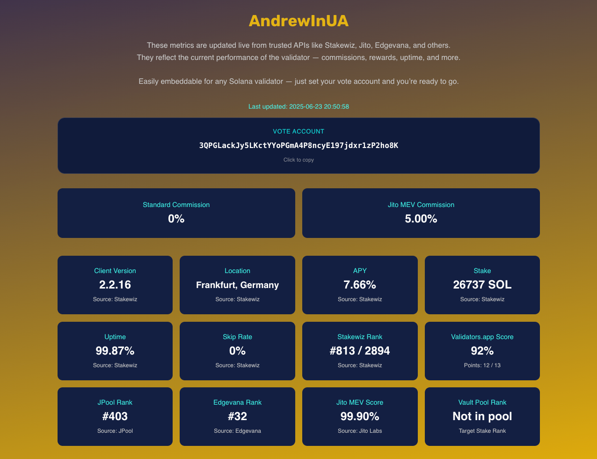

# 🧩 Solana Validator Metrics Widget

A flexible, embeddable HTML+CSS+JS widget for displaying detailed Solana validator stats — built and maintained by [AndrewInUA](https://andrewinua.com/).  
It pulls data from trusted sources like Stakewiz, Jito, Edgevana, and others, and presents it in a clear, adaptive layout.  
Perfect for validator websites, personal dashboards, or community portals.

---



## 🌐 Live demo

A working demo is available here:  
🔗 <a href="https://andrewinua.com/validator-metrics-widget-demo" target="_blank">andrewinua.com/validator-metrics-widget-demo</a>

This demo showcases how the widget looks with real data.  
You are welcome to test it, explore its layout, — then personalize it for your own validator with code in this repo.

---

## ✅ **Features**
- 🧩 Easy to embed on any website (pure HTML/CSS/JS)
- 📊 Real-time data from Stakewiz, Jito, Edgevana, JPool, and Vault
- 🎨 Clean, mobile-friendly design
- ⚙️ Fully customizable styles and layout
- 🔁 Supports any validator via vote key

---

## 🛠 How to use

### 🔹 Option 1 — Direct include

1. Clone or download this repository.
2. Place the three files in your HTML project:
   - ```index.html```
   - ```validator-widget.js```
   - ```validator_widget_style.css```
3. Add this code to your page:

```
<link rel="stylesheet" href="validator_widget_style.css"><br>
<div id="solana-validator-widget" data-vote-account="Your-vote-address-here"></div><br>
<script src="validator-widget.js"></script>
```

📌 Replace ```Your-vote-address-here``` with your own validator's vote account.

---

### 🔹 Option 2 — Inline embed (no external files)

If you prefer to include the widget inline in your site, copy the content of the following files and wrap them in appropriate tags:

```
<style><br>
    <!-- Paste content of validator_widget_style.css here --><br>
</style><br><br>

<div id="solana-validator-widget" data-vote-account="Your-vote-address-here"></div><br><br>

<script><br>
    <!-- Paste content of validator-widget.js here --><br>
</script>
```

---

## 🔧 Customization

- **Vote account** is defined via ```data-vote-account```.
- **Widget description text** is editable inside the HTML:

```
<p class="widget-description"><br>
  These metrics are updated live from trusted APIs like Stakewiz, Jito, Edgevana, and others.<br><br>
  They reflect the current performance of the validator — commissions, rewards, uptime, and more.<br><br><br>
  Easily embeddable for any Solana validator — just set your vote account and you’re ready to go.<br>
</p>
```

- **Hide any metric**:  
  If you'd like to remove or temporarily hide a specific metric:
  - You can comment out its tile in the HTML and in JS.
  - Or hide it via CSS:

```
#jpool-rank { display: none; }
```

---

## 🧠 Why this widget?

This project was born out of necessity — a need for clean, transparent, and visually pleasing validator stats for simple website.  
This widget offers a lightweight, adaptable solution — powered entirely by public APIs.

---

📡 **Data Sources**
- [Stakewiz API](https://stakewiz.com)
- [Jito API](https://jito.network)
- [Edgevana API](https://stake.edgevana.com)
- [JPool Scores API](https://app.jpool.one/validators)
- [Solana Vault GitHub Data](https://github.com/SolanaVault/stakebot-data)

---

## 🤝 Open & Community-Friendly

This widget is open-source and free to use for all Solana validators, developers, and ecosystem contributors.  
You can modify, extend, or integrate it however you like — no restrictions.

If you find it helpful and decide to use or build upon it, a link back or mention of this repo is always appreciated — but not required.

🛠 Contributions are welcome, and suggestions or improvements are encouraged.  
Let’s build better validator tools together and support decentralization, transparency, and open access in the Solana ecosystem.

---

Made with ❤️ by AndrewInUA  
🔗 <a href="https://andrewinua.com" target="_blank">andrewinua.com</a>
